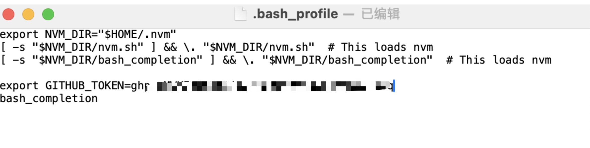

## Electron Forge
Electron Forge 是一个处理 Electron 应用程序打包与分发的一体化工具。 在工具底层，它将许多现有的 Electron 工具 (例如 @electron/packager、 @electron/osx-sign、electron-winstaller 等) 组合到一起，因此我们不必费心处理不同系统的打包工作

Electron Forge文档：[www.electronforge.io](https://www.electronforge.io/cli#commands)


## 构建命令
Electron Forge有三个主要的构建命令：

- electron-forge package
- electron-forge make
- electron-forge publish

每一步都依赖于上一步的输出。比如运行make命令，会先运行package命令，然后package的运行结果会传给make命令。

运行publish，会先运行package，再运行make，最后运行publish。

### package命令
package命令会将应用程序打包成特定平台的可执行程序包，并将结果放入一个文件夹中。请注意，这不会生成可分发的格式。要制作合适的分发文件，请使用Make命令。


### make命令
make命令将根据Forge配置以及我们传递的参数为应用程序制作分发文件


### publish

publish命令会先运行package、make命令将应用程序进行打包、制作成可分发文件，然后尝试发布到forge配置中定义的发布服务器上。

如果发布到github release，需要在本地设置github token，步骤如下


**1. 创建 GitHub 个人访问令牌：**
- 登录你的 GitHub 账号。
- 点击右上角的头像，选择 “Settings”。
- 在左侧菜单中，点击 “Developer settings”。
- 选择 “Personal access tokens”。
- 点击 “Generate new token”。
- 填写令牌说明（Note），并设置令牌的权限。对于发布 Electron 应用到 GitHub Release，你需要勾选以下权限：
    - `public_repo`（如果项目是公共仓库）
    - `repo`（如果项目是私有仓库）
- 点击 “Generate token”，复制生成的令牌，这个令牌就是你的 `GITHUB_TOKEN`。

**2. 设置环境变量：**

- **在命令行中临时设置（仅当前终端会话有效）：**
    - Windows（Command Prompt）：
    - ```
      set GITHUB_TOKEN=your_token_here
      ```
    - Windows（PowerShell）：
    - ```
      $env:GITHUB_TOKEN="your_token_here"
      ```
    - macOS/Linux（Bash）：
    - ```
      export GITHUB_TOKEN=your_token_here
      ```
- **永久设置环境变量：**
    - **Windows：**
        - 右键点击 “此电脑” / “我的电脑”，选择 “属性”。
        - 点击 “高级系统设置”。
        - 在 “系统属性” 窗口，点击 “环境变量” 按钮。
        - 在 “系统变量” 区域，点击 “新建” 按钮。
        - 变量名输入 `GITHUB_TOKEN`，变量值输入你的令牌。
        - 点击 “确定” 保存设置。
    - **macOS（通过修改 shell 配置文件）：**
        - 打开终端。
        - 如果使用 Bash，输入：
        - ```
          open -e ~/.bash_profile
          ```
        - 如果使用 Zsh，输入：
        - ```
          open -e ~/.zshrc
          ```
        - 在打开的文件中添加以下行：
        - ```
          export GITHUB_TOKEN=your_token_here
          ```
        - 保存文件并关闭编辑器。
        - 使更改生效：
        - ```
          source ~/.bash_profile    # 如果是 Bash
          ```
        - 或者
        - ```
          source ~/.zshrc          # 如果是 Zsh
          ```
    - **Linux（以 Ubuntu 为例，修改 Bash 配置文件）：**
        - 打开终端。
        - 输入：
        - ```
          nano ~/.bashrc
          ```
        - 在文件末尾添加：
        - ```
          export GITHUB_TOKEN=your_token_here
          ```
        - 保存文件（`Ctrl+O`），退出编辑器（`Ctrl+X`）。
        - 使更改生效：
        - ```
          source ~/.bashrc
          ```

设置完成后，再次运行 `npm run publish` 就应该可以正常发布应用到 GitHub Release 了。

这里，我是永久设置的：




## Github Action流水线
新建./github/workflows/forge-build.yml：
```yml
name: Release

on:
  push:
    branches:
      - feature/forge
    tags:
      - 'v*'

jobs:
  build:
    runs-on: ${{ matrix.os }}
    strategy:
      matrix:
        os: [windows-latest, ubuntu-latest, macos-latest]
    steps:
    - uses: actions/checkout@v4
    - name: Install and Build
      run: npm install && npm run publish
      env:
        GITHUB_TOKEN: ${{ secrets.GH_TOKEN }}
```