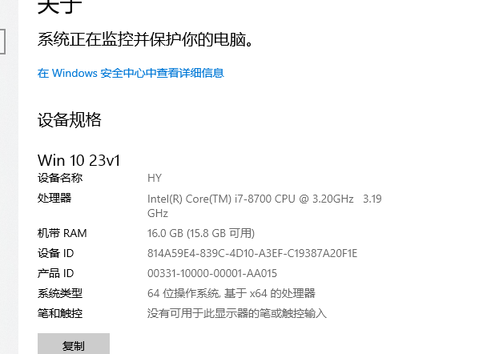
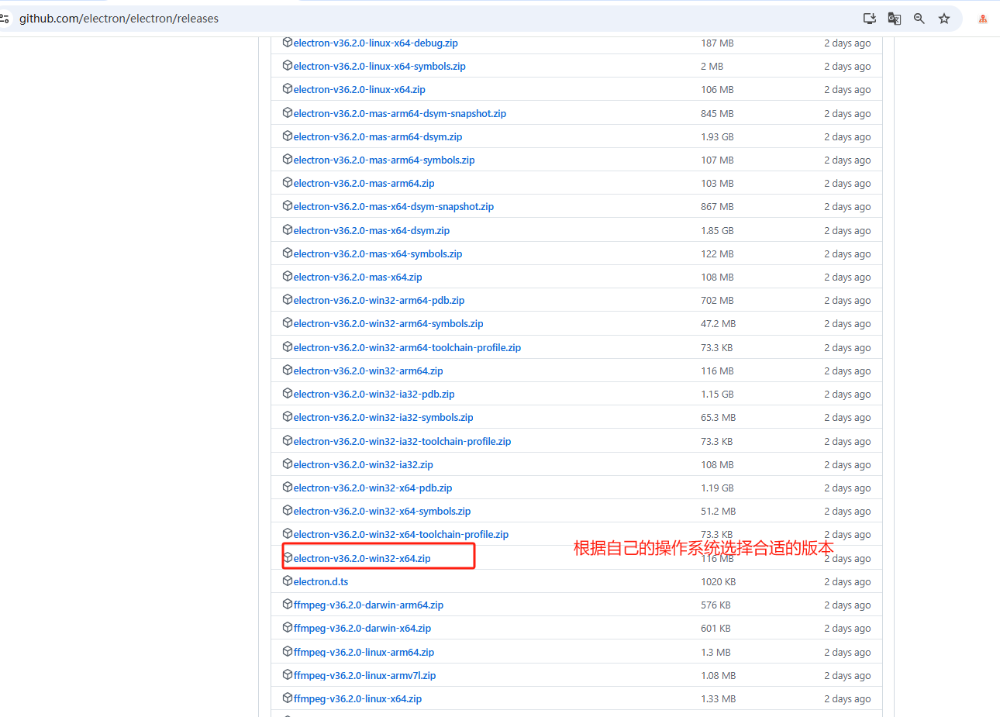
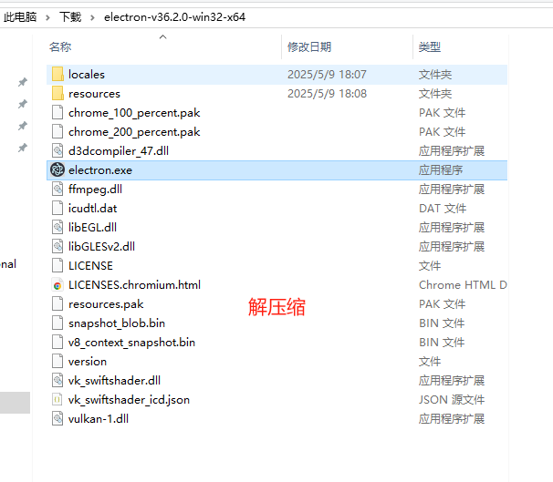
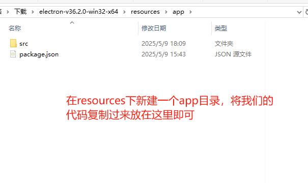
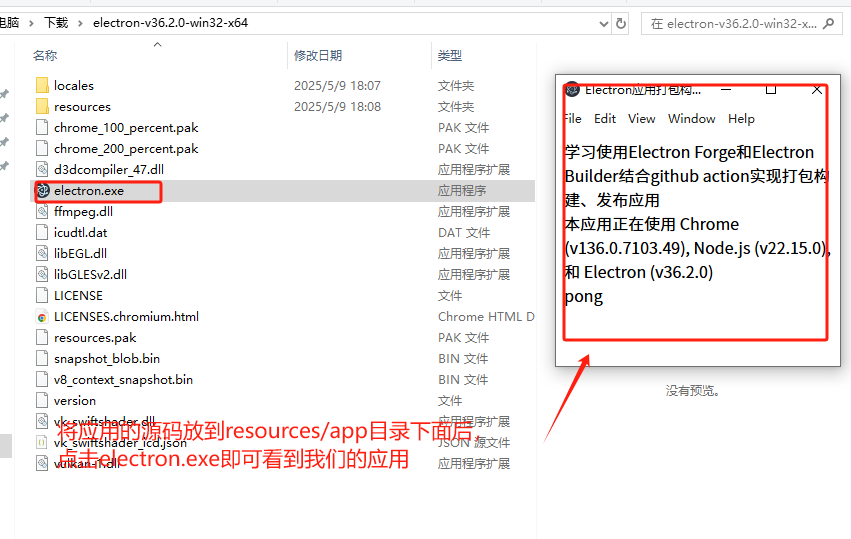

## 手动打包electron应用

### 第一步：使用预构建可执行文件
去electron的[Github Release](https://github.com/electron/electron/releases)下载预构建可执行文件。

比如我的电脑是window系统

所以下载下面的版本

下载完成后，解压，解压后的文件如下：

在resources目录下新建一个app，然后把我们的代码放在这里

然后点击electron.exe就可以启动我们的应用

