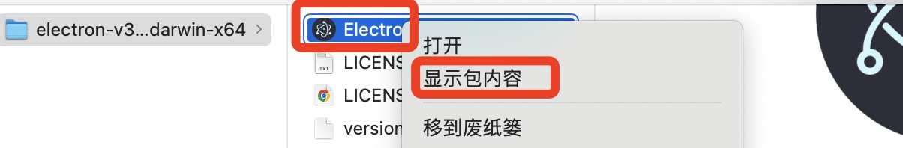

## 手动打包electron应用
在这篇文章中，我们将脱离Electron常用的打包工具，比如electron forge或者electron build，尝试自己手动打包Electron应用并重命名应用名字。

我们使`Electron 预构建可执行文件`一步一步打包我们的应用，并且使用asar将我们的应用程序源代码存档。最后我们可以简单的了解一下Electron Package的打包原理及过程。


### 一、使用Electron预构建可执行文件
首先去electron的[Github Release](https://github.com/electron/electron/releases)下载预构建可执行文件。这里可以根据自己电脑的系统配置下载对应的版本即可。下载下来的Electron就是一个可以直接启动的app。如果是window，可以直接点击electron.exe启动应用。如果是Mac，可以直接点击Electron.app启动应用。默认的Electron应用源码入口resources/default_app.asar。如果需要Electron启动的是我们自己的应用，那么可以直接在resources目录下新建一个app目录，将我们的应用源码比如src和package.json放进app目录下面即可。或者将src和package.json打包成app.asar，将打包的asar放到resources/下面即可。这样点击electron.exe或者Electron.app启动的就是我们的应用了。下面会简单介绍window系统和mac系统的源码替换过程。

#### 1.1 window系统
如果电脑是window系统


所以下载下面的版本


下载完成后，解压，解压后的文件如下：


在resources目录下新建一个app，然后把我们的代码放在这里


然后点击electron.exe就可以启动我们的应用


#### 1.2 mac系统
需要确认mac处理器是ARM64架构还是x64架构。可以通过选择mac的“关于本机”，在这个窗口中，你会看到 “芯片” 或 “处理器” 信息。如果显示的是 “Apple 芯片”（如 M1、M2 等），那么你的 Mac 是 ARM64 架构。如果显示的是英特尔（Intel）处理器，那么它就是 x64 架构。

由于我的mac是英特尔处理器，因此选择下载下面的zip


解压缩后，右键显示包内容




在包内容中的Contents/Resources/目录下新建一个app文件夹，存放我们的源代码：


双击Electron，就可以启动我们的应用了


### 二、将我们的应用源码打包成asar
如果你没有使用 Parcel 或 Webpack 之类的构建工具，为了减轻拷贝源文件的分发压力，你可以把你的 app 打包成一个 asar 包来提升在 Windows 等平台上读取文件的性能。

为了使用一个 asar 档案文件代替 app 文件夹，需要将app打包为app.asar，然后将其放到 Electron 的Resources资源文件夹下，然后 Electron 就会试图读取这个app.asar档案文件并从中启动。

首先运行 `npm install --engine-strict @electron/asar` 安装[asar](https://github.com/electron/asar)

然后我们写个脚本，将src和pacakge.json一起打包成一个app.asar文件：


然后在package.json中添加打包命令：


运行 `npm run asar`，即可在src同级目录下看到一个app.asar文件了

#### 2.1 window系统
复制生成的app.asar文件，放到electron的resources目录下：


点击electron.exe可以看到应用启动了。

#### 2.2 mac系统

复制生成的app.asar文件，放到electron的resources目录下：


>以上，我们使用Electron预构建文件来启动我们的应用，并且将应用源码打包成app.asar。接下来我们来了解一下如何重命名我们的应用。

### 三、重命名、如何定制我们的应用

当我们使用Electron构建我们的应用程序后，我们还需要在把应用分发给用户前，将Electron应用进行重新定制。

#### 3.1 window定制
您可以将electon.exe重命名为您喜欢的任何名称，也可以通过rcedit编辑其图标和其他信息。

#### 3.2 mac定制
默认情况下，当我们点击下面的Electron.app启动应用时，活动监视器的名称如下所示：


现在我们将它改成录屏大帝。

首先，将Electron.app重命名成录屏大帝.app：


修改Electron.app/Contents/Info.plist下面几个字段：
```xml
<key>CFBundleDisplayName</key>
<string>录屏大帝</string>
<key>CFBundleExecutable</key>
<string>录屏大帝</string>
<key>CFBundleName</key>
<string>录屏大帝</string>
```


将Electron.app/Contents/MacOS/Electron重命名为Electron.app/Contents/MacOS/录屏大帝

同时还要将Electron.app/Contents/Frameworks/Electron Helper.app、Electron.app/Contents/Frameworks/Electron Helper (GPU).app、Electron.app/Contents/Frameworks/Electron Helper (Renderer).app这三个app文件重命名为

- Electron.app/Contents/Frameworks/录屏大帝 Helper.app
- Electron.app/Contents/Frameworks/录屏大帝 Helper (GPU).app
- Electron.app/Contents/Frameworks/录屏大帝 Helper (Renderer).app

同时还要重新命名上面三个.app文件包内容里面的MacOS/Electron Helper、MacOS/Electron Helper (GPU)、MacOS/Electron Helper (Renderer)。并且修改相应的info.plist

Electron.app/Contents/Frameworks/录屏大帝 Helper.app/Contents/info.plist:

```xml
<key>CFBundleName</key>
<string>录屏大帝</string>
<key>CFBundleDisplayName</key>
<string>录屏大帝 Helper</string>
<key>CFBundleExecutable</key>
<string>录屏大帝 Helper</string>
```


Electron.app/Contents/Frameworks/录屏大帝 Helper (GPU).app/Contents/info.plist:
```xml
<key>CFBundleName</key>
<string>录屏大帝 Helper (GPU)</string>
<key>CFBundleDisplayName</key>
<string>录屏大帝 Helper (GPU)</string>
<key>CFBundleExecutable</key>
<string>录屏大帝 Helper (GPU)</string>
```

Electron.app/Contents/Frameworks/录屏大帝 Helper (Renderer).app/Contents/info.plist:
```xml
<key>CFBundleName</key>
<string>录屏大帝 Helper (Renderer)</string>
<key>CFBundleDisplayName</key>
<string>录屏大帝 Helper (Renderer)</string>
<key>CFBundleExecutable</key>
<string>录屏大帝 Helper (Renderer)</string>
```

最终的目录结构如下：


点击`录屏大帝.app`启动我们的应用，可以发现应用名字、进程名字也已经被重命名了。


### 四、Electron Package打包过程
如果阅读@electron/packager的源码可以发现，

在[src/platform.ts](https://github.com/electron/packager/blob/main/src/platform.ts)文件中，将我们的源代码打包成app.asar。


在[src/mac.ts](https://github.com/electron/packager/blob/main/src/mac.ts)文件中，定制我们的应用，比如重命名应用名称，应用图标等。


实际上做的就是我们前面手动打包的过程。


### npm install electron安装的是什么

如果仔细观察，我们通过npm install electron后，会在node_modules里安装了一个electron，而这个electron就是我们前面从electron github release下载的文件。

electron/dist就是我们解压zip后的内容，两者是一致的：


所以当我们使用electron forge或者electron build等打包工具打包时，这些工具会自动从node modules/electron中复制一个electron可执行文件出来，然后将我们src下面的源码和package.json一起打包成app.asar，放到复制出来的electron的资源文件Resources目录下，并重命名。这就是打包工具的原理。